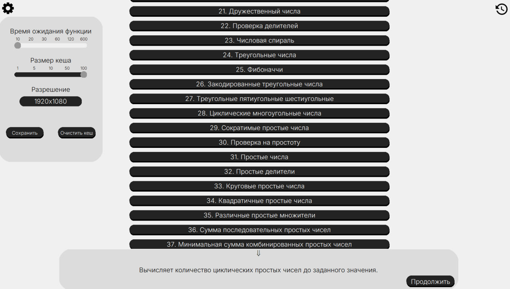

# Project Euler GUI на Tkinter

## Описание

Мой первый проект.
Это графическое приложение на **Python (tkinter)**, объединяющее решённые задачи с сайта **Project Euler** и удобный интерфейс для их запуска.

Пользователь может:

* выбрать задачу из списка,
* ввести входные данные,
* получить решение прямо в приложении.

Особенности:

* Современный кастомный интерфейс с анимациями панелей и кнопок.
* Вычисления выполняются в отдельном процессе, чтобы интерфейс не зависал.
* Фоновый процесс всегда активен: лёгкие задачи запускаются без ожидания.
* Возможность задать таймаут ожидания — процесс завершается автоматически, чтобы приложение не застряло навсегда.
* Поддержка кеширования результатов в JSON для ускорения повторных запусков.
* Возможность менять разрешение окна в настройках.

---

### Главное окно



---

### Установка зависимостей

```bash
pip install -r requirements.txt
```


## Функциональность

* Выбор одной из реализованных задач Project Euler.
* Валидация и преобразование пользовательского ввода.
* Настройка времени ожидания фонового процесса.
* Управление кешем решений (JSON).
* Просмотр истории результатов в виде таблицы (`pandas.DataFrame`).
* Возможность работы с массивами и списками чисел.


## Как добавить новую задачу

В `form.py` есть словарь `input_library_with_nums`. Пример записи:

```python
from Features import MathOperations

input_library_with_nums["Сумма чисел"] = (
    "Ints",                         # метод проверки ввода
    MathOperations.sum_of_numbers,  # функция из Features
    ("Введите число:",),            # подсказки для ввода
    "Сумма чисел: {reply}",         # формат ответа
    "Возвращает сумму чисел от 1 до n."  # описание
)
```

* Ключ проверки (`"Ints"`, `"ListInt"`, и т.п.) описан в `Check_methods`.
* Преобразование ввода управляется словарём `Type_methods`.


## Кеширование

* Все результаты сохраняются в `total.json`.
* Для больших результатов запись обрезается.
* Повторные вызовы возвращаются из кеша, что ускоряет работу.
* Возможность очистить кеш.
